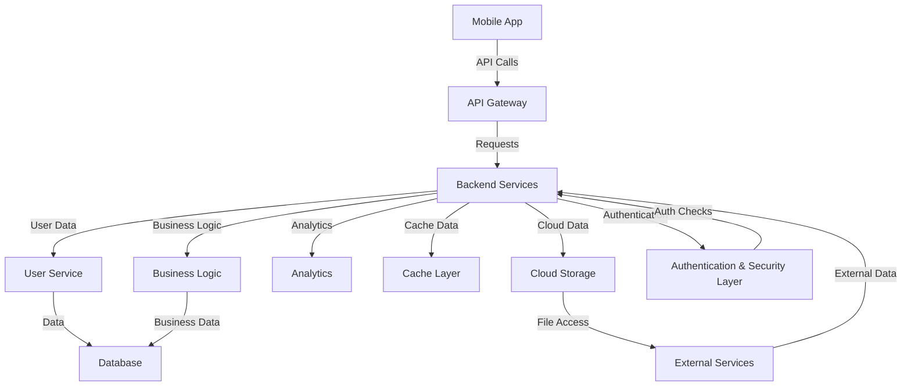

```mermaid
graph TD;
    A[Mobile App] -->|API Calls| B[API Gateway];
    B -->|Requests| C[Backend Services];
    C -->|User Data| D[User Service];
    C -->|Business Logic| E[Business Logic];
    C -->|Analytics| F[Analytics];
    D -->|Data| G[Database];
    E -->|Business Data| G;
    C -->|Cache Data| H[Cache Layer];
    C -->|Cloud Data| I[Cloud Storage];
    I -->|File Access| J[External Services];
    C -->|Authentication| K[Authentication & Security Layer];
    K -->|Auth Checks| C;
    J -->|External Data| C;
```